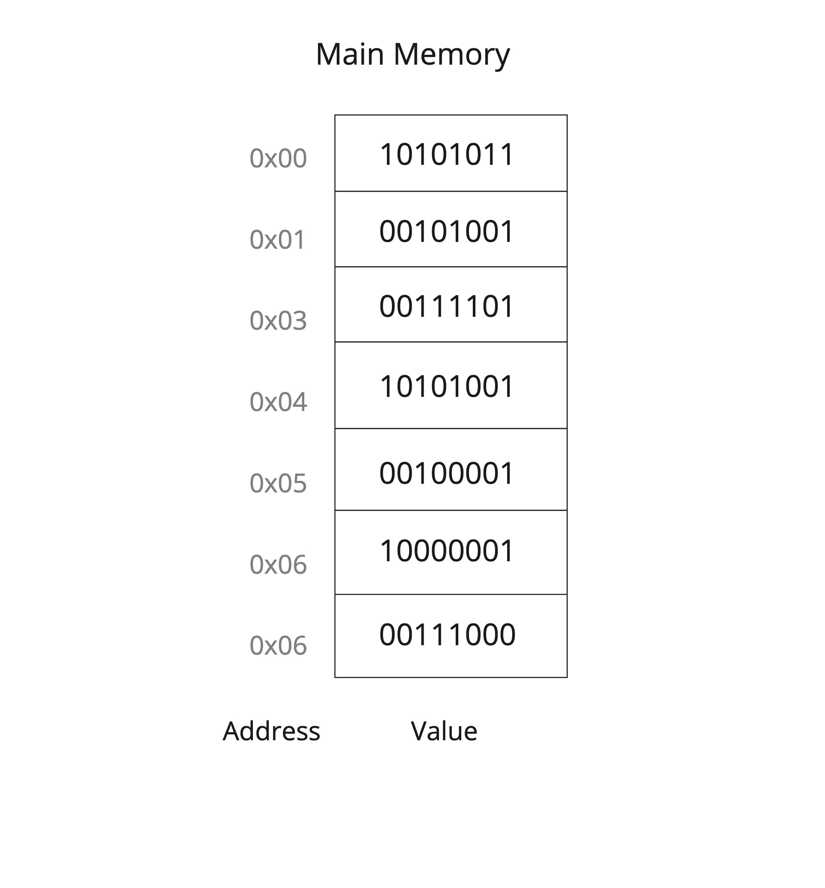
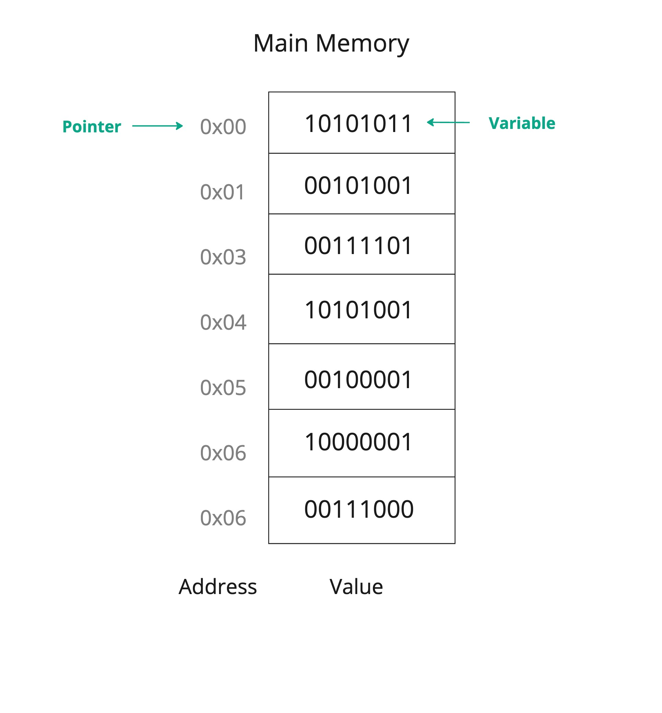

# Pointers 
Every variable we declare is stored in the memory so we don’t lose it. This memory is divided into cells, and each cell in the memory has its own address. In other words, when we declare a variable the program store this variable in the memory and access its value using the memory cell address. Same concept can be applied on real-life, for example each one of your friends has his own house. When you want to visit one of them you will access or find that friend in his own address.



## Concept
A `pointer` is a reference variable that stores a memory cell address.



> A normal variable will reference a value, while a pointer reference a memory address.

We will use pointers to store memory addresses. Therefore, before declaring any pointers we need to first understand how to get a memory address of a variable.

To get the memory address of a variable we will use *address-of operator* `&` as follows.

```cpp
#include <iostream>
using namespace std;

int main() {
    int num = 10; 
    
    cout << num;
    cout << endl;
    cout << &num;

    return 0;
}
```

output,

```
10
0x7ffed9bf7d8c
```
As you can see, the first number is the value that the variable holds, and it is what we always learned to get or access. The second output is the memory address of the variable `num`.

Now, let us create a new pointer to hold the value of `num` address. And to do so we will use the `*` character.

```cpp
#include <iostream>
using namespace std;

int main() {
    int num = 10; 
    int* pointer = &num;
    
    cout << num;
    cout << endl;
    cout << pointer;

    return 0;
}
```

output,
```
10
0x7ffce54b7454
```

In the code above we declared a pointer called `pointer` to hold the address of variable `num`, And the `int` type of the pointer tells the pointer what data type is stored in that memory address.

> The type of pointer must match the type of value it references.

> You can declare a pointer in different ways, such as, `int* pointer`, `int * pointer`, and ` int *pointer`.

### Dereferencing
Dereference a pointer means getting the value referenced by the pointer. It can be done using `*` character which is called *dereference operator*. 

```cpp 
#include <iostream>
using namespace std;

int main() {
    int num = 10; 
    int* pointer = &num;
    int valueOfPointer = *pointer; //dereference the pointer.
    
    cout << num;
    cout << endl;
    cout << valueOfPointer; 

    return 0;
}
```

output,
```
10
10
```
<!-- Extra note. -->
 <!-- Though it might not be obvious, but we used `int` data type to store the value resulting from dereferencing the pointer. It worked out since we previously gave the pointer a data type of `int` when we declare it to specify what type of value is stored in the pointer address. -->

### Why Pointers? 
Sometimes, when we want to update a value, it might not work as expected. Let us try to update a value using a function. 

```cpp
#include <iostream>
using namespace std;

void setNum(int number){
    number = 7;
}

int main() {
    int num = 10; 
    
    cout << num;
    cout << endl;
    
    setNum(num);
    
    cout << num;

    return 0;
}
```

output,
```
10
10
```
In the function above, even though we passed the `num` as a parameter value, it did not change. The reason is because that `num` was not actually passed to the function, a copy of `num` did.

Therefore, if we encountered this type of cases we can use pointers. Since pointers stores addresses then we can pass the address of `num` and then update the value that the address points to as the following.

```cpp 
#include <iostream>
using namespace std;

void setNum(int* pointer){
    *pointer = 7;
}

int main() {
    int num = 10; 
    
    cout << num;
    cout << endl;
    
    setNum(&num);
    
    cout << num;

    return 0;
}
```
output,

```
10
7
```

## Examples

```cpp
#include <iostream>
using namespace std;

int main()
{
    int num1 = 17;
    int num2 = 11;

    cout << "num1 address: "<< &num1 << endl;
    cout << "num2 address: " << &num2 << endl;

    return 0;
}
```

```
num1 address: 0x7ffed50c655c
num2 address: 0x7ffed50c6558
```


## Projects

- Create a pointer to reference a variable address and then print the value of that variable using the pointer.

- Develop a function that accepts an integer and doubles it, then print the value from the main method.
