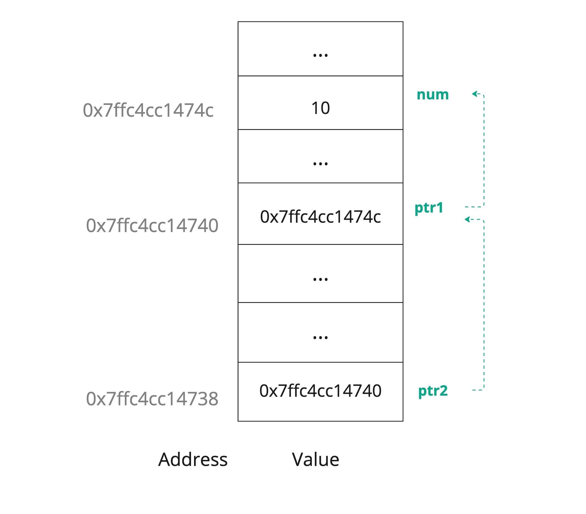

# Pointer to Pointer
Earlier, we learned about pointers, and we now know that pointers are a special kind of variables that store a reference to a memory address of a variable. Here, we will cover a new concept, which is a pointer that references another pointer.

## Concept
Pointer to a pointer is a type of pointers that is used to reference another pointer, it is like forming a chain of pointers referencing each other.

And to create a pointer to a pointer, we will use an extra `*` character as follows.

```cpp
#include <iostream>
using namespace std;

int main() {
    int num = 10;
    int* ptr1 = &num;
    int** ptr2 = &ptr1;
    
    cout << "Value of num: " << num << endl;
    cout << "Address of num: " << &num << endl;
    
    cout << "Value of ptr1: " << ptr1 << endl;
    cout << "Address of ptr1: " << &ptr1 << endl;
    
    cout << "Value of ptr2: " << ptr2 << endl;
    cout << "Address of ptr2: " << &ptr2 << endl;
    return 0;
}

```

```
Value of num: 10
Address of num: 0x7ffc4cc1474c
Value of ptr1: 0x7ffc4cc1474c
Address of ptr1: 0x7ffc4cc14740
Value of ptr2: 0x7ffc4cc14740
Address of ptr2: 0x7ffc4cc14738
```

## Example

Use the concept of pointer to a pointer to update a variable referenced by the first pointer.

```cpp
#include <iostream>
using namespace std;

int main() {
    int num = 10;
    int* ptr1 = &num; //pointer to num
    int** ptr2 = &ptr1; // pointer to ptr1
    
    cout << "Value of num *before* updating: " << num << endl;
    
    **ptr2 = 30;
    
    cout << "Value of num *after* updating: " << num << endl;
    return 0;
}
```

```
Value of num *before* updating: 10
Value of num *after* updating: 30
```

Create multiple references and use the last pointer to pointer variable to update the value of `num`. 

```cpp
#include <iostream>
using namespace std;

int main() {
    int num = 10;
    int* ptr1 = &num;
    int** ptr2 = &ptr1;
    int*** ptr3 = &ptr2;
    int**** ptr4 = &ptr3;
    
    cout << "Value of num *before* updating: " << num << endl;
    
    ****ptr4 = 30;
    
    cout << "Value of num *after* updating: " << num << endl;
    return 0;
}
```

```
Value of num *before* updating: 10
Value of num *after* updating: 30
```

> With each extra pointer, we add another `*` character.

## Projects

- [Pointer to Pointer Project](https://github.com/SAFCSP-Team/pointer-to-pointer-project)
